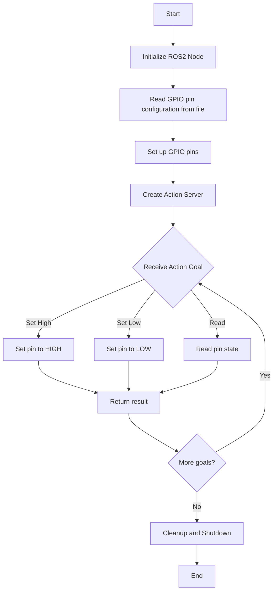

# Pi GPIO ROS Node

## Overview
This ROS2 node provides an interface to control and read GPIO pins on a Raspberry Pi using ROS2 actions. It allows for setting pins high or low and reading their current state.

## Node Flowchart
Below is a flowchart describing the operation of the Pi GPIO node:



## Features
- Set default GPIO pins high or low
- Set GPIO pins on pcf8574 I2C expander high or low
- Read the current state of GPIO pins and pcf8574 I2C expander pins
- Configurable pin setup through a text file
- Uses ROS2 action server for non-blocking operations

## Prerequisites
- ROS2 Humble
- Raspberry Pi with GPIO pins
- RPi.GPIO Python library

## Installation and Setup

1. Clone this repository into your ROS2 workspace's `src` directory:
   ```
   cd ~/ros2_ws/src
   git clone https://github.com/your-username/pi_gpio.git
   cd pi_gpio
   ```

2. Run the setup script to install custom dependencies:
   ```
   ./install-custom-rosdep.sh
   ```
   This script will install all required dependencies, including custom ones, without modifying system-wide rosdep files.

3. Install standard ROS dependencies:
   ```
   cd ~/ros2_ws
   rosdep install --from-paths src --ignore-src -r -y
   ```

4. Build the package:
   ```
   colcon build --packages-select pi_gpio
   ```

5. Source the setup file:
   ```
   source ~/ros2_ws/install/setup.bash
   ```

## Usage
1. Source your ROS2 workspace:
   ```
   source ~/ros2_ws/install/setup.bash
   ```
2. Run the node:
   ```
   ros2 run pi_gpio gpio_node
   ```

## Configuration
Pin configuration is read from a file named `gpio_pins.txt`. Each line in this file should contain a pin number and its type (in/out), separated by a comma. For example:
```
17,out
18,in
```

## ROS2 Interface
This node provides an action server named `pi_gpio_server` of type `GPIO` (from `mr_interfaces.action`).

### Action Definition
- Goal: A string containing the pin number and the action (e.g., "17,high" or "18,read")
- Result: An integer value (3 for set operations, pin state for read operations)
- Feedback: A placeholder integer (always 1)

### Example Usage
To set pin 17 high:
```
ros2 action send_goal /pi_gpio_server mr_interfaces/action/GPIO "{gpio: '17,high'}"
```

To read the state of pin 18:
```
ros2 action send_goal /pi_gpio_server mr_interfaces/action/GPIO "{gpio: '18,read'}"
```

## License
[Add your license information here]

## Contributors
[Add contributor information here]
