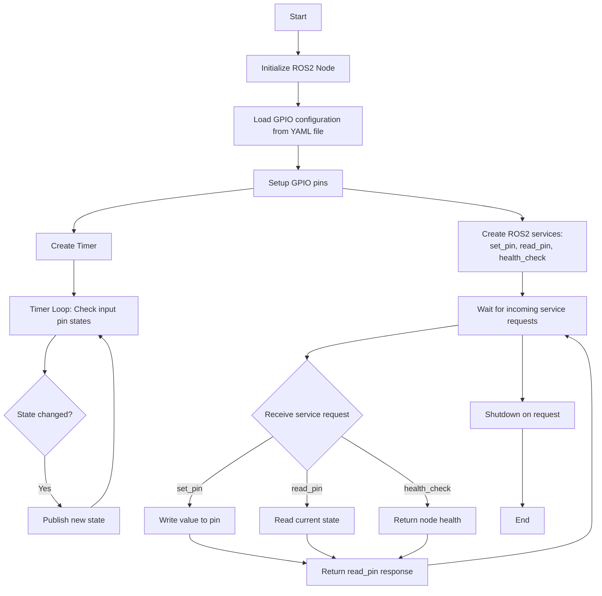

# Pi GPIO ROS Node

## Table of Contents
- [Overview](#overview)
- [Node Flowchart](#node-flowchart)
- [Features](#features)
- [Prerequisites](#prerequisites)
- [Installation and Setup](#installation-and-setup)
- [Usage](#usage)
- [Configuration](#configuration)
- [ROS2 Interfaces](#ros2-interfaces)
- [License](#license)
- [Contributors](#contributors)

## Overview
This ROS2 node provides an interface to control and read GPIO pins on a Raspberry Pi. It supports two implementations:
- **BuiltinGPIOServer** which uses the Raspberry Pi’s built-in GPIO with the RPi.GPIO library
- **PCF8574Server** which utilizes the PCF8574 I2C GPIO expander

Both servers are built on a common base that reads pin configurations from a YAML file. They expose ROS2 services to set and read GPIO pins as well as a health check service. Additionally, input pin states are published periodically.

## Node Flowchart
Below is a revised flowchart describing the node’s operation:


```mermaid
graph TD
    A[Start] --> B[Initialize ROS2 Node]
    B --> C[Load GPIO configuration from YAML file]
    C --> D[Setup GPIO pins]
    D --> E[Create ROS2 services:<br>set_pin, read_pin, health_check]
    D --> F[Create Timer]
    
    %% Timer branch
    F --> G[Timer Loop: Check input pin states]
    G --> H{State changed?}
    H -- Yes --> I[Publish new state]
    I --> G
    
    %% Service branch (runs concurrently)
    E --> K[Wait for incoming service requests]
    K --> L{Receive service request}
    L -- set_pin --> M[Write value to pin]
    L -- read_pin --> N[Read current state]
    L -- health_check --> O[Return node health]
    M --> P[Return set_pin response]
    N --> P[Return read_pin response]
    O --> P
    P --> K
    
    K --> Q[Shutdown on request]
    Q --> R[End]
```

## Features
- Supports two GPIO server implementations:
  - BuiltinGPIOServer (uses RPi.GPIO)
  - PCF8574Server (uses the PCF8574 I2C expander)
- Configurable pin setup via YAML file (e.g., `io_config.yaml`, `pcf8574_config.yaml`)
- ROS2 services for:
  - Setting a pin value (`set_pin`)
  - Reading a pin state (`read_pin`)
  - Health checking the node (`health_check`)
- Periodic publishing of input pin states

## Prerequisites
- ROS2 Humble
- Raspberry Pi hardware (for built-in GPIO or PCF8574 I2C expander)
- Required libraries:
  - RPi.GPIO (for built-in GPIO)
  - adafruit_pcf8574 (for PCF8574)
  - Other standard ROS2 Python packages

## Installation and Setup

1. Clone this repository into your ROS2 workspace's `src` directory:
   ```
   cd ~/ros2_ws/src
   git clone https://github.com/your-username/pi_gpio.git
   cd pi_gpio
   ```

2. Run the setup script to install custom dependencies:
   ```
   ./install-custom-rosdep.sh
   ```
   This script installs all required dependencies without modifying system-wide rosdep files.

3. Install standard ROS dependencies:
   ```
   cd ~/ros2_ws
   rosdep install --from-paths src --ignore-src -r -y
   ```

4. Build the package:
   ```
   colcon build --packages-select pi_gpio
   ```

5. Source the setup file:
   ```
   source ~/ros2_ws/install/setup.bash
   ```

## Usage

1. Source your ROS2 workspace:
   ```
   source ~/ros2_ws/install/setup.bash
   ```

2. Run the node with the desired implementation:
   - For built-in GPIO pins:
     ```
     ros2 run pi_gpio gpio_node
     ```
   - For the PCF8574 GPIO expander:
     ```
     ros2 run pi_gpio pcf8574_gpio_server
     ```

3. Interact with the node via its ROS2 services:
   - **Set a pin**:
     ```
     ros2 service call /<node_name>/set_pin mr_interfaces/srv/SetGPIO "{pin_id: '17', value: true}"
     ```
   - **Read a pin**:
     ```
     ros2 service call /<node_name>/read_pin mr_interfaces/srv/ReadGPIO "{pin_id: '17'}"
     ```
   - **Health check**:
     ```
     ros2 service call /<node_name>/health_check std_srvs/srv/Trigger "{}"
     ```

   Replace `<node_name>` with `gpio_server` for the built-in implementation or `pcf8574_server` for the PCF8574 implementation.

## Configuration
GPIO pin configuration is loaded from a YAML file. Two example configuration files are provided:
- `resource/io_config.yaml` for the built-in GPIO pins
- `resource/pcf8574_config.yaml` for the PCF8574 expander

Each configuration file should define a list of pins with their numbers, types (in/out), and descriptions. Example:
```
pins:
  - pin: 17
    type: "out"
    description: "Motor controller relay control"
  - pin: 18
    type: "in"
    description: "Sensor input"
```

## ROS2 Interfaces
The node provides the following ROS2 services:
- **set_pin** (`mr_interfaces/srv/SetGPIO`): Sets an output pin’s value.
- **read_pin** (`mr_interfaces/srv/ReadGPIO`): Reads the state of a pin.
- **health_check** (`std_srvs/srv/Trigger`): Checks if the node is running correctly.

## License
[Add your license information here]

## Contributors
[Add contributor information here]
